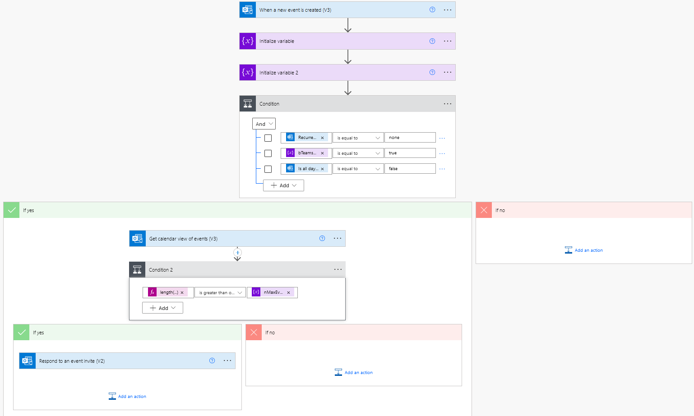

This Microsoft Flow checks incoming calendar items to see if:
- The invite is for a Teams meeting.
- The invite is for a non-recurring meeting.
- The invite is not for an all-day event.

If all of the above are true, and the date for the invite already contains a 
certain number of calendar items, the meeting gets declined with a response.

Setup
1) Download the zip file.
1) Go to the Flow portal and choose Import.
1) Upload the zip file.
1) Open the flow and change the calendar to your calendar.
1) Set your treshold of daily calendar items in 'Initialize variable'.
1) Save.

