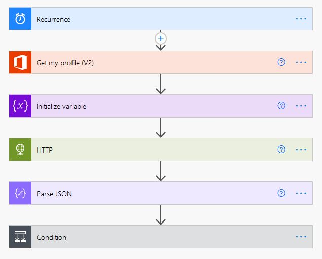

This Microsoft Flow applies to Dutch residents only, and will notify them per e-mail when their birth year is up for making an appointment to get vaccinated against corona.

The Flow by default runs daily, and will take the following information from your Office 365 user profile:
- Birthdate is used to determine your year of birth. When not filled in, it will default to '0001'. In that case, either complete your profile, or adjust the step determining the birth year with setting it manually.
- E-mail address is used to send the notification to.

The corona test website is used to determine if your year is up.

